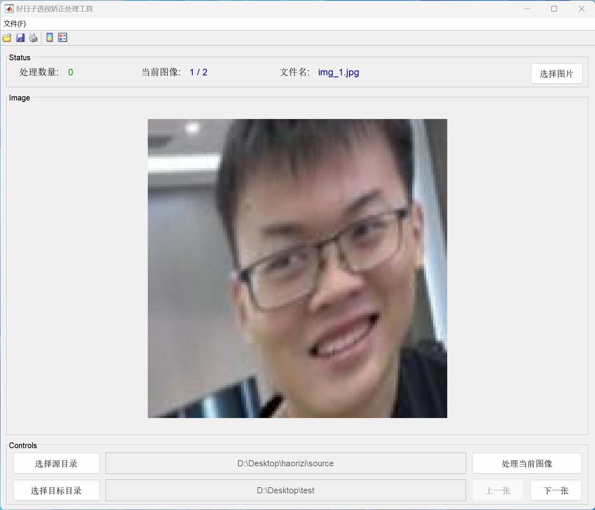
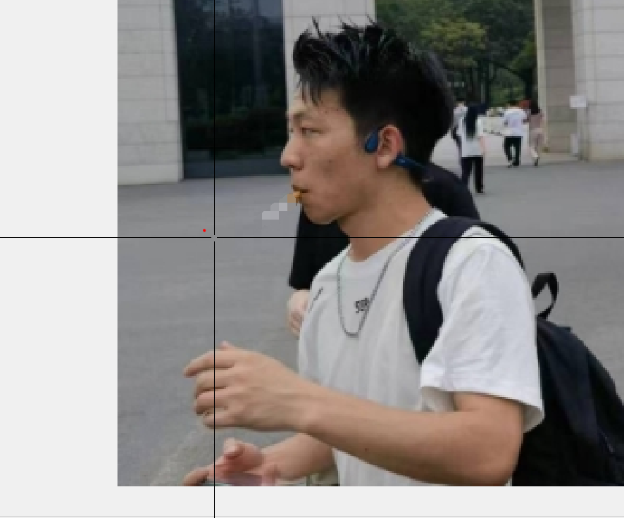

# 好日子透视矫正处理工具
## 1. 👓界面

## 2. 👙功能
这是一款用于手动透视矫正的处理工具，可以批量加载图片，对图片进行透视矫正，一般用于矫正屏幕拍摄的图片。

## 3. 🩴操作

* 程序分三部分，上方的状态栏，中间的图片显示区，下方的操作栏。

* 进入程序之后必须选择源目录和目标目录，选择完之后，程序会从第一张图片开始加载。点击“上一张”按钮则切换到上一张图片，“下一张”按钮同理。

* 可以点击上方的“选择图片”按钮，弹出输入框，输入图片的序号，则可切换到对应序号的图片。

* 点击右下方的“处理当前图片”按钮则可进行透视矫正的点选取操作。

* 在图片上点击鼠标左键选择点，选择四个点之后，则会将透视矫正的图片保存到目标目录中。

* 选点过程中，点击鼠标右键则可终端选点操作，重新进行选点。
